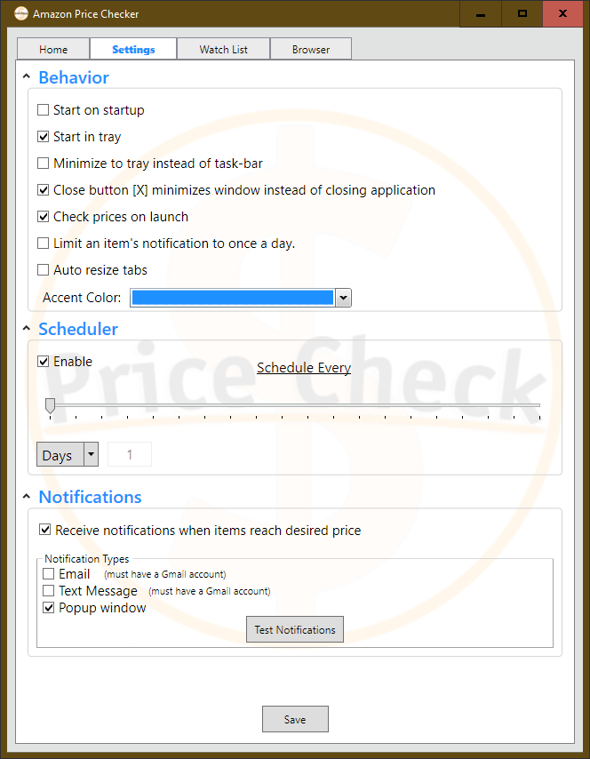

# Amazon Price Checker

[](https://lorenza12.github.io/Amazon-Price-Checker/)


# About

 Create a watch list of amazon items to have atomically price checked to see if they are are at or below your desired price.

# Features

* Set a schedule to have the application automatically check amazon item prices behind the scenes
  - Hours
  - Days
* Receive 3 different types of notifications when an item reaches your desired price
  - Email
  - Text Message
  - Window Popup
* Minimize the application to the windows taskbar to allow for contentious price checks without disruptions
* Built in browser to easily find items to watch
* Easily edit or remove any items you choose to watch
* Limit the application's notifications to once a day to prevent any redundant notifications if you are setup to check prices multiple times a day

# Instillation 

1. Clone and build the project. You can run the application from the bin folder : 
```
~\Amazon-Price-Checker\src\Amazon Price Check\bin\Release\Amazon Price Checker.exe
```

2. Visit the [github.io](https://lorenza12.github.io/Amazon-Price-Checker/) page to download the zip version of the application.


# Screenshots

### Home Page


### Settings



### Item Watch


### Browser


### Misc


## Authors

* lorenza12
